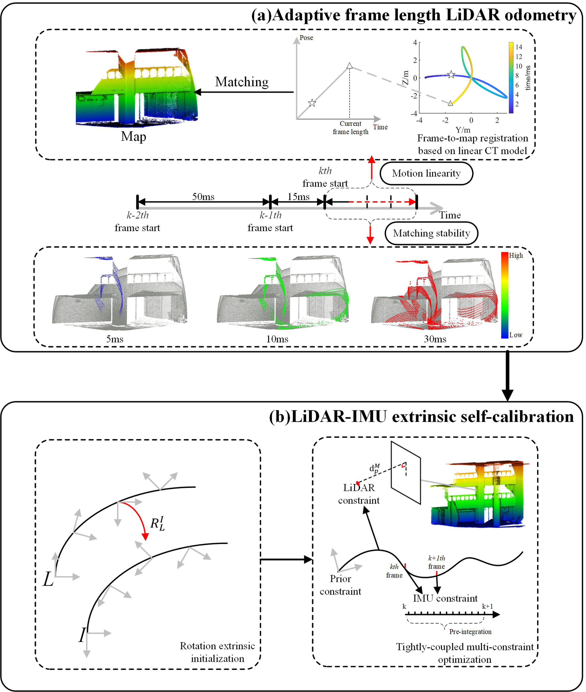

# AFLI-Calib: Robust LiDAR-IMU extrinsic self-calibration based on adaptive frame length LiDAR odometry
This is the official implementation (refactor version based on the experiment code) of the following publication:

> **AFLI-Calib: Robust LiDAR-IMU extrinsic self-calibration based on adaptive frame length LiDAR odometry**<br/>
> [Weitong Wu](https://3s.whu.edu.cn/info/1027/1861.htm), [Jianping Li](https://3s.whu.edu.cn/info/1026/1959.htm), [Chi Chen](https://3s.whu.edu.cn/info/1025/1364.htm), [Bisheng Yang](https://3s.whu.edu.cn/info/1025/1415.htm), [Xianghong Zou](https://3s.whu.edu.cn/info/1027/1955.htm), Yandi Yang, [Yuhang Xu](https://3s.whu.edu.cn/info/1028/1964.htm), [Ruofei Zhong](https://iec.cnu.edu.cn/szdw/sssds/js2/aeeb2b52ad1e489fbb0da68b28822f2a.htm), Ruibo Chen<br/>
> *ISPRS Journal of Photogrammetry and Remote Sensing*<br/>
> [**Paper**](https://doi.org/10.1016/j.isprsjprs.2023.04.004)

## 🔭 Introduction

<p align="center">

</p>
<p align="justify">
<strong>Abstract:</strong> As an effective complement to common laser scanning systems, the portable laser scanning system can acquire
point clouds flexibly and quickly. Calibration between Light detection and ranging (LiDAR) sensors and inertial
measurement units (IMU) is the prerequisite for laser scanning systems to obtain high-quality point clouds.
Related methods have been proposed in the last two decades, where the global navigation satellite system (GNSS)
or high-precision calibration fields are commonly used. However, the extrinsic self-calibration of LiDAR-IMU is
challenging, due to the large distortion in single-frame point cloud caused by rapid motion and the position
errors of IMU integration which drift quickly. At the same time, the highly dynamic motion patterns of portable
devices and the changes in the scanned scene structure are not well considered in existing LiDAR odometry
methods. To take better advantage of the characteristics of non-repetitive scanning LiDAR sensor, this paper
proposes AFLI-Calib, which utilizes adaptive frame length LiDAR odometry to perform the extrinsic selfcalibration
of LiDAR-IMU. <strong>Unlike LiDAR odometry methods with a fixed frame length, the LiDAR frame
length is dynamically adjusted according to the motion state of sensors and the matching stability of scenes.</strong>The
single-frame point cloud is registered to the map through a linear-based continuous-time model, eliminating the
motion distortion correction in advance. For further optimization of trajectory and extrinsic parameters, IMU raw
measurements and LiDAR observations are involved in the multi-constraint optimization, through tightlycoupled
IMU pre-integration constraints, LiDAR point-to-plane constraints, and prior constraints. The method
is fully validated using self-collected calibration data of indoor and outdoor scenes and different motion modes.
Experiments show that on the test data, the translation parameter accuracy of the method is 0.041 m, which is
56.3% higher than the state-of-the-art method. The standard deviation is significantly reduced, with translation
deviation (0.017 m, 0.024 m, 0.022 m) and rotation deviation (0.17◦, 0.25◦, 0.15◦), which verifies the robustness
of our method. The average RMSE of distances to the reference point cloud acquired by the terrestrial laser
scanning system (TLS) is 0.042 m, showing a high accuracy calibration result. Comparative experiments with the
fixed frame length LiDAR odometry method and classical “correction-then-registration” motion distortion model
further verify the superiority and effectiveness of the proposed adaptive frame length LiDAR odometry.
</p>

## 💻 Requirements
The code has been tested on:
- Ubuntu 18.04
- ROS melodic
- GTSAM 4.0.3
- Ceres 2.1.0

## ✏️ Build & Run
### 1. How to build this project

```bash
cd ~/catkin_ws/src
git clone https://github.com/DCSI2022/AFLI_Calib.git
cd AFLI_Calib
catkin_make
```
Need solve the dependency before catkin_make, or use Docker

### Docker (Recommended)

```
docker build -t $image_name:tag . #build custom name and tag from Dockerfile
docker run -it -v ~/catkin_ws/src/AFLI_Calib:/home/catkin_ws/src/AFLI_Calib --network host $image_name:tag
cd /home/catkin_ws # in container
catkin_make # in container 
```

### RUN AFLO
  ```
  rosrun afli_calib afl_lidarOdometry $rosbag_path $lidar_type $lidar_topic $match_stability_threshold $motion_linearity_threshold $rosbag_start $rosbag_end
  ```
  
lidar_type: 1 LIVOX 2 VELODYNE 3 OUSTER 4 HESAI

### RUN LiDAR-IMU extrinsic calibration
  ```
  rosrun afli_calib tight_licalib $rosbag_path $lo_path $lidar_type $lidar_topic $rosbag_start $rosbag_end %still_time
  ```
## Todo
- [ ] Modify parameters using yaml file

## 💡 Citation
If you find this repo helpful, please give us a star .
Please consider citing AFLI-Calib if this program benefits your project
```
@article{wu2023afli,
  title={AFLI-Calib: Robust LiDAR-IMU extrinsic self-calibration based on adaptive frame length LiDAR odometry},
  author={Wu, Weitong and Li, Jianping and Chen, Chi and Yang, Bisheng and Zou, Xianghong and Yang, Yandi and Xu, Yuhang and Zhong, Ruofei and Chen, Ruibo},
  journal={ISPRS Journal of Photogrammetry and Remote Sensing},
  volume={199},
  pages={157--181},
  year={2023},
  publisher={Elsevier}
}
```

## 🔗 Related Projects
We sincerely thank the excellent projects:
- [loam_livox](https://github.com/hku-mars/loam_livox) for inspiring the idea of the adaptive frame length
- [ikd-Tree](https://github.com/hku-mars/ikd-Tree) for point cloud map management;
- [GTSAM](https://github.com/borglab/gtsam) for IMU pre-integration and factor graph optimization;
- [Ceres](https://github.com/ceres-solver/ceres-solver) for auto-diff.
- [Sopuhs](https://github.com/strasdat/Sophus)
- [PCL](https://github.com/PointCloudLibrary/pcl)
- [A-LOAM](https://github.com/HKUST-Aerial-Robotics/A-LOAM)
